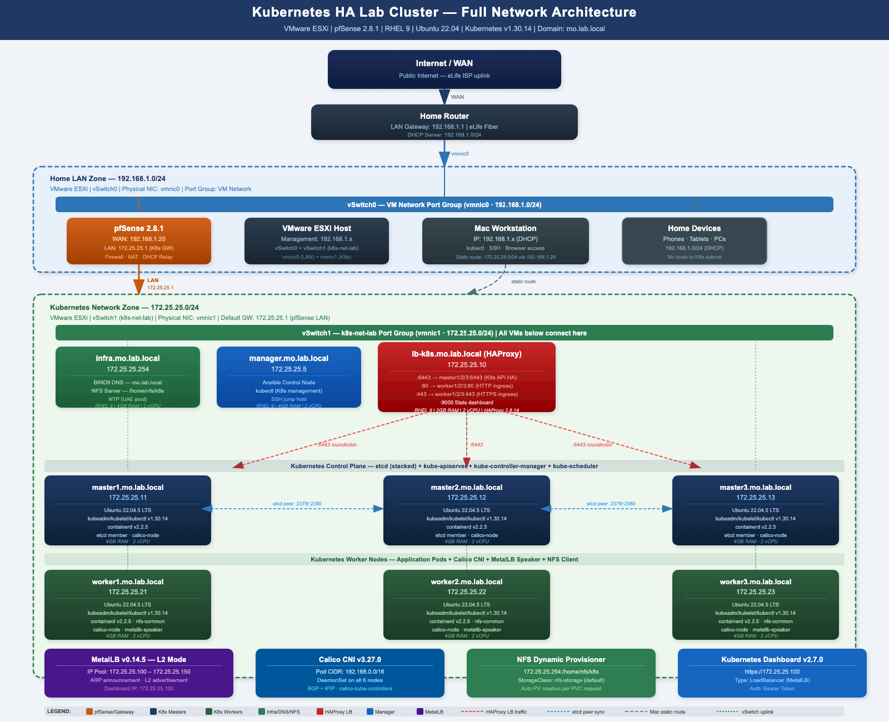
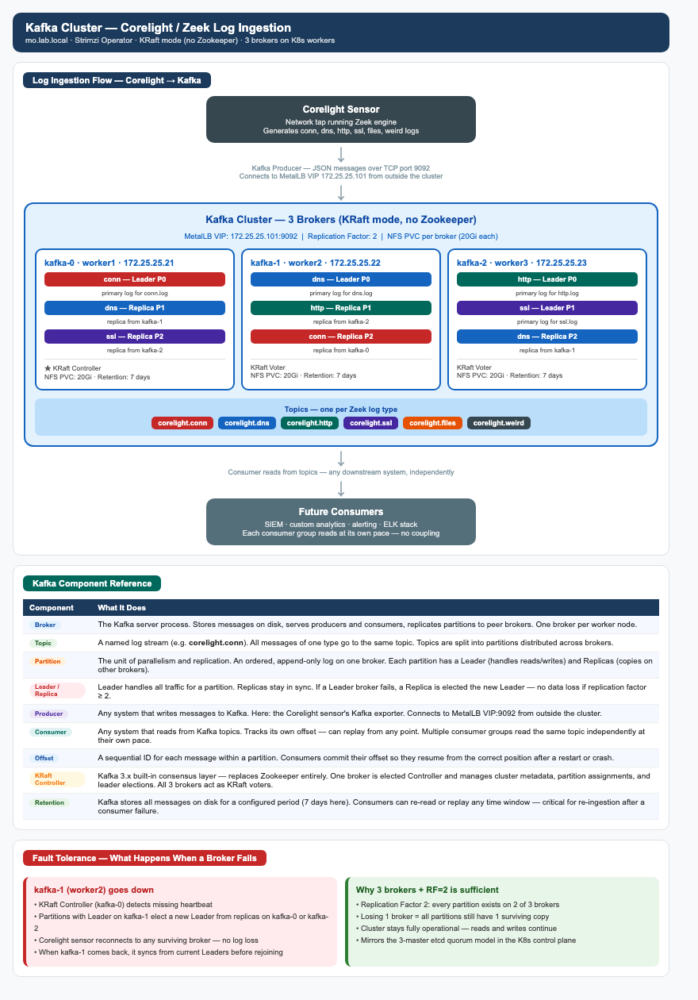
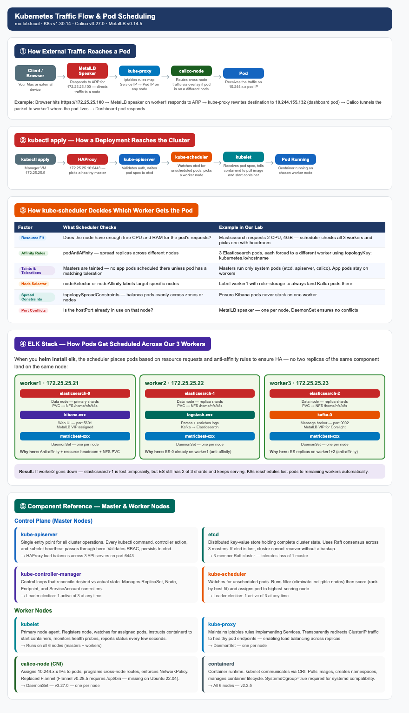

# Kubernetes HA Lab Cluster on VMware ESXi

> **Environment:** Home Lab — VMware ESXi | **Domain:** mo.lab.local | **K8s Version:** v1.30.14 | **Status:** Fully Operational

---

## Table of Contents

1. [Architecture Overview](#1-architecture-overview)
2. [Node Inventory](#2-node-inventory)
3. [Infrastructure Deep Dive](#3-infrastructure-deep-dive)
   - ESXi Hypervisor
   - pfSense Gateway & Firewall
   - BIND9 DNS Server
   - NFS Storage Server
   - HAProxy Load Balancer
   - Manager / Ansible Controller
   - Kubernetes Cluster Nodes
4. [ESXi Virtual Switch Setup](#4-esxi-virtual-switch-setup)
5. [pfSense Installation & Configuration](#5-pfsense-installation--configuration)
6. [Clone Config Repo](#6-clone-config-repo-on-manager-vm)
7. [BIND9 DNS Server](#7-bind9-dns-server-infra--172252554)
8. [NFS Storage Server](#8-nfs-storage-server-infra--172252554)
9. [HAProxy Load Balancer](#9-haproxy-load-balancer-lb-k8s--1722552510)
10. [Manager VM — Ansible Setup](#10-manager-vm--ansible-setup-172252555)
11. [Prepare All K8s Nodes via Ansible](#11-prepare-all-k8s-nodes-via-ansible)
12. [Initialize Kubernetes Cluster](#12-initialize-kubernetes-cluster-master1)
13. [Join Control Plane Nodes](#13-join-master2-and-master3)
14. [Join Worker Nodes](#14-join-worker-nodes)
15. [Install Calico CNI](#15-install-calico-cni)
16. [Install MetalLB](#16-install-metallb)
17. [Install Kubernetes Dashboard](#17-install-kubernetes-dashboard)
18. [Install Metrics Server](#18-install-metrics-server)
19. [Install NFS Dynamic Provisioner](#19-install-nfs-dynamic-provisioner)
20. [Current Cluster Status](#20-current-cluster-status)
21. [Next Steps — ELK & Kafka for Corelight](#21-next-steps--elk--kafka-for-corelight-sensor-logs)
22. [Files in This Repo](#22-files-in-this-repo)
23. [Access Endpoints](#23-access-endpoints)
24. [Component Versions](#24-component-versions)
25. [Troubleshooting](#25-troubleshooting)
26. [Kubernetes Traffic Flow & Pod Scheduling](#26-kubernetes-traffic-flow--pod-scheduling)

---

## 1. Architecture Overview

```
Internet
    │
[Home Router] 192.168.1.1
    │
    │   Home LAN (192.168.1.0/24) ── vSwitch0 (vmnic0)
    │
[MacBook] 192.168.1.x
    │   static route: 172.25.25.0/24 via 192.168.1.20
    │
[pfSense 2.8.1]
  WAN: 192.168.1.20  (vSwitch0)   ← NAT + Firewall + Routing
  LAN: 172.25.25.1   (vSwitch1)
    │
    │   K8s Network (172.25.25.0/24) ── vSwitch1 k8s-net-lab (vmnic1)
    │
    ├── [infra]    172.25.25.254   RHEL 9        BIND9 DNS + NFS Server
    ├── [lb-k8s]   172.25.25.10    RHEL 9        HAProxy Load Balancer
    ├── [manager]  172.25.25.5     RHEL 9        Ansible + kubectl + Helm
    │
    ├── [master1]  172.25.25.11    Ubuntu 22.04  K8s Control Plane + etcd
    ├── [master2]  172.25.25.12    Ubuntu 22.04  K8s Control Plane + etcd
    ├── [master3]  172.25.25.13    Ubuntu 22.04  K8s Control Plane + etcd
    │
    ├── [worker1]  172.25.25.21    Ubuntu 22.04  K8s Worker Node
    ├── [worker2]  172.25.25.22    Ubuntu 22.04  K8s Worker Node
    └── [worker3]  172.25.25.23    Ubuntu 22.04  K8s Worker Node

MetalLB IP Pool:      172.25.25.100 – 172.25.25.150
Kubernetes Dashboard: https://172.25.25.100
Kubernetes API VIP:   https://172.25.25.10:6443  (via HAProxy)
```



---

## 2. Node Inventory

| Hostname | IP | OS | Role | vCPU | RAM |
|---|---|---|---|---|---|
| pfsense | WAN: 192.168.1.20 / LAN: 172.25.25.1 | pfSense 2.8.1 | Gateway / Firewall / NAT | 2 | 2 GB |
| infra.mo.lab.local | 172.25.25.254 | RHEL 9 | BIND9 DNS + NFS Server | 2 | 4 GB |
| lb-k8s.mo.lab.local | 172.25.25.10 | RHEL 9 | HAProxy Load Balancer | 2 | 2 GB |
| manager.mo.lab.local | 172.25.25.5 | RHEL 9 | Ansible + kubectl + Helm | 2 | 4 GB |
| master1.mo.lab.local | 172.25.25.11 | Ubuntu 22.04 | K8s Control Plane + etcd | 2 | 4 GB |
| master2.mo.lab.local | 172.25.25.12 | Ubuntu 22.04 | K8s Control Plane + etcd | 2 | 4 GB |
| master3.mo.lab.local | 172.25.25.13 | Ubuntu 22.04 | K8s Control Plane + etcd | 2 | 4 GB |
| worker1.mo.lab.local | 172.25.25.21 | Ubuntu 22.04 | K8s Worker Node | 2 | 4 GB |
| worker2.mo.lab.local | 172.25.25.22 | Ubuntu 22.04 | K8s Worker Node | 2 | 4 GB |
| worker3.mo.lab.local | 172.25.25.23 | Ubuntu 22.04 | K8s Worker Node | 2 | 4 GB |

---

## 3. Infrastructure Deep Dive

### VMware ESXi — The Hypervisor Foundation

ESXi is a Type-1 bare metal hypervisor that runs directly on the physical server hardware with no host operating system underneath it. All resources — CPU, RAM, storage, and network — are dedicated to the hypervisor and allocated to virtual machines with minimal overhead.

In this lab ESXi hosts all 10 virtual machines on a single physical server. Without a hypervisor, 10 physical machines would be required. ESXi provides full control over networking through virtual switches, enabling the creation of isolated networks that behave exactly like physical networks.

**Virtual Switch Design:**

| vSwitch | Physical NIC | Network | Purpose |
|---|---|---|---|
| vSwitch0 | vmnic0 | 192.168.1.0/24 | Home LAN — ESXi management + pfSense WAN |
| vSwitch1 (k8s-net-lab) | vmnic1 | 172.25.25.0/24 | Dedicated K8s network — all lab VMs |

vSwitch1 is a completely internal network that exists only inside the ESXi host. No VM on this network can reach the internet directly — all traffic must pass through pfSense, giving full control over ingress and egress.

---

### pfSense — Gateway, Firewall & NAT

pfSense is the network gateway that sits between the home LAN and the Kubernetes network. It is the only VM with interfaces in both networks and serves three critical functions:

**NAT (Network Address Translation)**
VMs on 172.25.25.0/24 have private IPs not routable on the internet. When a VM needs to reach the internet to pull container images or install packages, pfSense translates the private IP to its own WAN IP (192.168.1.20) before sending traffic out. Return traffic is translated back and forwarded to the correct VM.

**Routing**
Without pfSense, a MacBook on 192.168.1.x has no path to reach 172.25.25.0/24. The static route `sudo route add -net 172.25.25.0/24 192.168.1.20` tells the Mac to send all K8s network traffic to pfSense, which forwards it to the correct VM.

**Firewall & Network Isolation**
The Kubernetes network is completely isolated from the home LAN by design. Pods, services, and nodes cannot be accidentally reached by other home network devices unless explicitly allowed through pfSense. This mirrors how a real data center DMZ operates.

---

### BIND9 DNS Server — infra.mo.lab.local (172.25.25.254)

Every component in this cluster communicates by hostname. Kubernetes relies heavily on DNS — CoreDNS inside the cluster resolves internal service names like `kubernetes.default.svc.cluster.local`, but for the infrastructure layer (nodes, HAProxy, NFS) a real DNS server that understands the lab domain `mo.lab.local` is required.

**Without DNS:**
- Every `/etc/hosts` file on every VM would need to be maintained manually and kept in sync
- Any IP change would require updating every machine
- Kubernetes TLS certificates are issued to hostnames — without proper DNS resolution, certificate validation fails

BIND9 serves both forward resolution (`master1-k8s.mo.lab.local → 172.25.25.11`) and reverse resolution (`172.25.25.11 → master1-k8s.mo.lab.local`). Reverse DNS is required by several Kubernetes components and etcdctl when verifying cluster health.

The infra VM is assigned 172.25.25.254 — the last usable IP in the subnet — making it easy to remember and ensuring it never conflicts with dynamically assigned addresses.

---

### NFS Storage Server — infra.mo.lab.local (172.25.25.254)

Kubernetes pods are stateless by default — when a pod restarts, any data written to its container filesystem is lost. Applications that require persistent data (databases, log stores, Elasticsearch indices, Kafka topics) need PersistentVolumes backed by real storage.

NFS (Network File System) provides shared storage that any node in the cluster can mount. The NFS Subdir External Provisioner installed in the cluster handles this automatically — when a pod requests storage via a PersistentVolumeClaim, the provisioner creates a dedicated subdirectory on `/home/nfs/k8s` on the infra VM and mounts it into the pod. Data persists across pod restarts, node reboots, and full cluster rebuilds as long as the NFS server is running.

This becomes critical in the next phase — Elasticsearch requires persistent storage for its index data, and Kafka requires persistent storage for message logs and offsets.

DNS and NFS are co-located on the same infra VM because they are both low-resource services that do not conflict with each other, reducing the number of VMs to manage.

---

### HAProxy Load Balancer — lb-k8s.mo.lab.local (172.25.25.10)

The Kubernetes API server runs on each master node on port 6443. If `kubectl` or any node pointed directly at master1 and master1 went down, all cluster communication would fail — defeating the purpose of HA.

HAProxy provides a single stable endpoint at `172.25.25.10:6443`. All nodes, kubectl on the manager, and the kubeadm join process all use this address. HAProxy continuously health-checks all three masters and routes traffic only to healthy instances. From any client's perspective, there is one API server that is always available.

HAProxy also handles application ingress traffic on ports 80 and 443, distributing requests across the three worker nodes so deployed applications are automatically load balanced.

| Port | Frontend | Backend | Purpose |
|---|---|---|---|
| 6443 | k8s_api_fe | master1/2/3 :6443 (roundrobin) | Kubernetes API HA |
| 80 | k8s_http_fe | worker1/2/3 :80 (roundrobin) | HTTP Ingress |
| 443 | k8s_https_fe | worker1/2/3 :443 (roundrobin) | HTTPS Ingress |
| 9000 | stats | — | HAProxy Statistics |

---

### Manager VM — manager.mo.lab.local (172.25.25.5)

The manager VM is the central control point for the entire infrastructure. It runs:

**Ansible** — executes playbooks across all 6 Kubernetes nodes simultaneously. Instead of SSHing into each node individually to install packages or change configuration, one `ansible-playbook` command handles all nodes in parallel. This prepared all 6 nodes for Kubernetes in minutes.

**kubectl** — the Kubernetes CLI configured with the admin kubeconfig from master1. All cluster operations (deploying applications, checking pod status, applying manifests) are performed from here without needing to SSH into master nodes.

**Helm** — the Kubernetes package manager used to install the NFS provisioner and will be used for ELK and Kafka deployments.

**Git** — the configuration repository is cloned here, making it the single source of truth for all infrastructure configuration.

---

### Kubernetes Master Nodes (172.25.25.11 – 172.25.25.13)

The three master nodes form the Kubernetes control plane. Each master runs the following services:

**etcd** — the distributed key-value database that stores the entire cluster state: every pod, service, configmap, secret, deployment, and node. It is the single source of truth for Kubernetes. Each master runs its own etcd instance and they form a cluster together, replicating data in real time using the Raft consensus algorithm.

**kube-apiserver** — the front door of Kubernetes. Every `kubectl` command, every action from a controller or scheduler, passes through the API server. It validates and authenticates requests then persists state to etcd. HAProxy load balances across all three API servers so if one master goes down, communication continues through the other two.

**kube-controller-manager** — runs all control loops that keep the cluster in the desired state. If a deployment requests 3 replicas and one pod dies, the controller manager creates a replacement. It manages node lifecycle, endpoints, and service accounts. Only one instance leads at a time via leader election — the others are on standby.

**kube-scheduler** — watches for newly created pods that have no node assigned and decides which worker node to place them on, considering CPU and memory availability, affinity rules, and taints. Like the controller manager, only one instance leads at a time.

**kube-proxy** — maintains network routing rules on each node so that traffic to a Service IP is forwarded to the correct pod regardless of which node it runs on.

**calico-node** — the CNI agent that programs pod networking across nodes and enforces NetworkPolicy rules.

**Why exactly 3 masters:**

etcd requires a quorum — a majority of members must agree before committing any write. With 3 masters, losing one still leaves 2 out of 3 available, maintaining quorum and keeping the cluster fully operational.

| Masters | Quorum Required | Can Tolerate |
|---|---|---|
| 1 | 1 | 0 failures — any failure = total outage |
| 2 | 2 | 0 failures — still no fault tolerance |
| **3** | **2** | **1 failure — cluster remains fully operational** |
| 5 | 3 | 2 failures |

With 2 masters, losing one means losing quorum and the entire cluster freezes even though one master is still running. 3 is the minimum meaningful HA configuration.

---

### Kubernetes Worker Nodes (172.25.25.21 – 172.25.25.23)

The three worker nodes are where all application workloads run. Each worker runs:

- **kubelet** — the agent that receives pod specifications from the API server and manages pod lifecycle on that node
- **kube-proxy** — maintains network routing rules for Kubernetes Services
- **containerd** — the container runtime that pulls images and runs containers
- **calico-node** — handles pod-to-pod networking and enforces network policies

With three workers, pods are distributed across nodes. If a worker goes down, Kubernetes automatically reschedules its pods onto the remaining workers. For ELK and Kafka, three workers allow running one replica per node — giving the applications their own HA layer independent of the Kubernetes control plane.

Masters are tainted with `node-role.kubernetes.io/control-plane` which prevents regular application pods from being scheduled on them. Only system components (etcd, apiserver, calico, kube-proxy) run on masters, keeping control plane resources dedicated and stable.

---

### MetalLB — Bare Metal Load Balancer

When a Kubernetes Service of type `LoadBalancer` is created, Kubernetes expects the underlying infrastructure to provide an external IP automatically. On AWS this provisions an ELB, on GCP a Cloud Load Balancer. On a bare metal or home lab cluster running on VMware, there is no cloud provider — Kubernetes waits forever and the service stays in `<pending>` state permanently.

MetalLB solves this by implementing the LoadBalancer service type for bare metal. It manages a pool of real IP addresses from the local network (172.25.25.100–150) and assigns them to services automatically.

**How it works:**
- **Controller** — watches for LoadBalancer services and assigns an IP from the configured pool
- **Speaker (DaemonSet)** — runs on every node. In L2 mode, the elected speaker responds to ARP requests for the assigned IP, making the network believe that IP belongs to that node. Traffic arrives at that node and kube-proxy distributes it to the correct pods.

**MetalLB vs alternatives:**

| | MetalLB (LoadBalancer) | NodePort | Ingress |
|---|---|---|---|
| External IP | Clean IP from your pool | Uses node IP + random high port (30000–32767) | Needs a LoadBalancer or NodePort behind it |
| Port | Standard — 80, 443, 9092 | Ugly random port e.g. `172.25.25.21:31234` | Standard via ingress controller |
| Protocol | Any TCP/UDP | Any TCP/UDP | HTTP/HTTPS only |
| Multiple services | Each gets its own clean IP | Same node IP, different ports — hard to manage | One IP, routes by hostname/path |
| Complexity | Simple — one manifest | No extra components | Requires ingress controller + rules |

MetalLB and Ingress are complementary, not competing — MetalLB gives the Ingress controller its external IP, and Ingress routes HTTP traffic internally by hostname or path. For non-HTTP services like Kafka (port 9092) and the Kubernetes API (port 6443), MetalLB is the only clean solution.

---

## 4. ESXi Virtual Switch Setup

### 4.1 — vSwitch0 (Home LAN — already exists)

Default ESXi switch connected to the home network. No changes needed.
- **Physical NIC:** vmnic0 | **Network:** 192.168.1.0/24

### 4.2 — Create vSwitch1 (Kubernetes Network)

1. ESXi web UI → **Networking** → **Virtual Switches** → **Add standard virtual switch**
2. Set: **Name:** `k8s-net-lab` | **Uplink:** `vmnic1` | **MTU:** 1500
3. Click **Add**

### 4.3 — Create Port Group on vSwitch1

1. **Networking** → **Port groups** → **Add port group**
2. Set: **Name:** `k8s-net-lab` | **VLAN ID:** `0` | **Virtual switch:** `k8s-net-lab`
3. Click **Add**

> Assign all K8s VMs to the **k8s-net-lab** port group.
> pfSense needs **two** adapters: `VM Network` (WAN) and `k8s-net-lab` (LAN).

---

## 5. pfSense Installation & Configuration

### 5.1 — Download pfSense ISO

https://www.pfsense.org/download/
- **Version:** 2.8.1 | **Architecture:** AMD64 | **Type:** DVD Image (ISO)

Upload ISO to ESXi: **Storage** → **Datastore browser** → **Upload**

### 5.2 — Create pfSense VM in ESXi

1. **Virtual Machines** → **Create / Register VM**
2. Settings: **Name:** `pfsense` | **OS:** FreeBSD 14+ (64-bit) | **CPU:** 2 | **RAM:** 2 GB | **Disk:** 20 GB
3. **Two network adapters:** Adapter 1 → `VM Network` (WAN) | Adapter 2 → `k8s-net-lab` (LAN)
4. Mount pfSense ISO on CD/DVD → Power on

### 5.3 — pfSense Installer

1. Accept copyright → **Install pfSense**
2. Keymap: **Continue with default keymap**
3. Partitioning: **Auto (UFS)** → select disk → **Entire disk** → **MBR** → **Finish** → **Commit**
4. Wait for install → **Reboot** → remove ISO

### 5.4 — Assign Interfaces on First Boot

```
Should VLANs be set up now? → n
Enter the WAN interface name: em0       (first NIC — vSwitch0)
Enter the LAN interface name: em1       (second NIC — vSwitch1)
Do you want to proceed? → y
```

### 5.5 — Set LAN IP from Console

```
2) Set interface(s) IP address → Select 2 (LAN)
IPv4 address: 172.25.25.1
Subnet bit count: 24
Upstream gateway: (blank — press Enter)
Enable DHCP on LAN: n
Revert to HTTP: n
```

### 5.6 — Configure via Web UI

Access: **https://192.168.1.20** — default credentials: `admin` / `pfsense`

- **System → General:** hostname `pfsense` | domain `mo.lab.local` | DNS `172.25.25.254`
- **Firewall → NAT → Outbound:** set to **Automatic** → Save
- **Firewall → Rules → LAN:** Add rule — Action: Pass | Protocol: Any | Source: LAN net | Destination: Any → Save → Apply Changes

### 5.7 — Static Route on Mac

```bash
sudo route add -net 172.25.25.0/24 192.168.1.20
```

---

## 6. Clone Config Repo on Manager VM

All configuration files are version-controlled in this repository. Clone once and use for all deployments.

```bash
ssh msalah@172.25.25.5
sudo -i
dnf install -y git
git clone https://github.com/mshgayar/k8s-pfsense-esxi.git /root/ansible-k8s
cd /root/ansible-k8s
```

---

## 7. BIND9 DNS Server (infra — 172.25.25.254)

### 7.1 — Install

```bash
ssh root@172.25.25.254
dnf install -y bind bind-utils
mkdir -p /etc/named/zones
```

### 7.2 — Copy Configuration Files from Repo

```bash
# Run from manager VM
scp /root/ansible-k8s/named.conf              root@172.25.25.254:/etc/named.conf
scp /root/ansible-k8s/named.conf.local        root@172.25.25.254:/etc/named/named.conf.local
scp /root/ansible-k8s/zones/db.mo.lab.local   root@172.25.25.254:/etc/named/zones/
scp /root/ansible-k8s/zones/db.172.25.25.rev  root@172.25.25.254:/etc/named/zones/
```

### 7.3 — Start and Verify

```bash
ssh root@172.25.25.254 "chown -R named:named /etc/named && systemctl enable --now named"

# Verify forward and reverse resolution
dig @172.25.25.254 master1-k8s.mo.lab.local
dig @172.25.25.254 -x 172.25.25.11
```

---

## 8. NFS Storage Server (infra — 172.25.25.254)

### 8.1 — Install

```bash
ssh root@172.25.25.254
dnf install -y nfs-utils
```

### 8.2 — Create Export and Configure

```bash
mkdir -p /home/nfs/k8s
chmod 777 /home/nfs/k8s
chown -R nobody:nobody /home/nfs/k8s

echo "/home/nfs/k8s 172.25.25.0/24(rw,sync,no_subtree_check,no_root_squash)" >> /etc/exports
```

### 8.3 — Start and Open Firewall

```bash
systemctl enable --now nfs-server
exportfs -rav

firewall-cmd --add-service=nfs --permanent
firewall-cmd --add-service=nfs3 --permanent
firewall-cmd --reload
```

### 8.4 — Verify

```bash
showmount -e 172.25.25.254
# Expected output: /home/nfs/k8s 172.25.25.0/24
```

---

## 9. HAProxy Load Balancer (lb-k8s — 172.25.25.10)

### 9.1 — Install

```bash
ssh root@172.25.25.10
dnf install -y haproxy
```

### 9.2 — Copy Configuration File from Repo

```bash
# Run from manager VM
scp /root/ansible-k8s/etc/haproxy/haproxy.cfg root@172.25.25.10:/etc/haproxy/haproxy.cfg

# Remove forwardfor option (incompatible with TCP mode frontends)
ssh root@172.25.25.10 "sed -i '/option.*forwardfor/d' /etc/haproxy/haproxy.cfg"
```

### 9.3 — Validate, Start and Open Firewall

```bash
ssh root@172.25.25.10 "haproxy -c -f /etc/haproxy/haproxy.cfg && systemctl enable --now haproxy"

ssh root@172.25.25.10 "
  firewall-cmd --permanent --add-port=6443/tcp
  firewall-cmd --permanent --add-port=80/tcp
  firewall-cmd --permanent --add-port=443/tcp
  firewall-cmd --permanent --add-port=9000/tcp
  firewall-cmd --reload"
```

### 9.4 — Verify

HAProxy statistics dashboard: **http://172.25.25.10:9000**

---

## 10. Manager VM — Ansible Setup (172.25.25.5)

### 10.1 — Install Ansible and Generate SSH Key

```bash
sudo -i
dnf install -y ansible-core
ssh-keygen -t rsa -b 4096 -f ~/.ssh/id_rsa -N ""
```

### 10.2 — Distribute SSH Key to All Nodes

```bash
ssh-copy-id msalah@172.25.25.11
ssh-copy-id msalah@172.25.25.12
ssh-copy-id msalah@172.25.25.13
ssh-copy-id worker1-k8s@172.25.25.21
ssh-copy-id worker2-k8s@172.25.25.22
ssh-copy-id worker3-k8s@172.25.25.23
```

### 10.3 — Configure Passwordless sudo

```bash
# Masters
for ip in 172.25.25.11 172.25.25.12 172.25.25.13; do
  ssh msalah@$ip "echo 'msalah ALL=(ALL) NOPASSWD:ALL' | sudo tee /etc/sudoers.d/msalah"
done

# Workers
ssh worker1-k8s@172.25.25.21 "echo 'worker1-k8s ALL=(ALL) NOPASSWD:ALL' | sudo tee /etc/sudoers.d/worker1-k8s"
ssh worker2-k8s@172.25.25.22 "echo 'worker2-k8s ALL=(ALL) NOPASSWD:ALL' | sudo tee /etc/sudoers.d/worker2-k8s"
ssh worker3-k8s@172.25.25.23 "echo 'worker3-k8s ALL=(ALL) NOPASSWD:ALL' | sudo tee /etc/sudoers.d/worker3-k8s"
```

### 10.4 — Test Ansible Connectivity

```bash
# Run from the repo directory — no need to copy hosts to /etc/ansible
cd /root/ansible-k8s
ansible all -i hosts -m ping
```

---

## 11. Prepare All K8s Nodes via Ansible

A single combined playbook handles everything across all 6 nodes simultaneously.

```bash
cd /root/ansible-k8s
ansible-playbook -i hosts prepare-k8s-nodes.yml
```

| Task | Details |
|---|---|
| Update packages | apt update + dist-upgrade |
| Install base packages | git, curl, vim, htop, net-tools, bash-completion, etc. |
| Disable swap | swapoff -a + remove from /etc/fstab |
| Kernel modules | overlay + br_netfilter loaded and persisted |
| sysctl | ip_forward + bridge-nf-call-iptables enabled |
| Install containerd | From Docker repo, SystemdCgroup=true configured |
| Disable UFW | Firewall disabled on all K8s nodes |
| Install Kubernetes | kubeadm + kubelet + kubectl v1.30 (packages held) |
| Enable kubelet | systemctl enable kubelet |

---

## 12. Initialize Kubernetes Cluster (master1)

```bash
ssh msalah@172.25.25.11

sudo kubeadm init \
  --control-plane-endpoint "172.25.25.10:6443" \
  --upload-certs \
  --pod-network-cidr=10.244.0.0/16

# Configure kubectl on master1
mkdir -p $HOME/.kube
sudo cp -i /etc/kubernetes/admin.conf $HOME/.kube/config
sudo chown $(id -u):$(id -g) $HOME/.kube/config
```

Copy kubeconfig to manager:

```bash
mkdir -p ~/.kube
scp msalah@172.25.25.11:/home/msalah/.kube/config ~/.kube/config
```

---

## 13. Join master2 and master3

On **master1** — generate fresh credentials (certificate key valid 2 hours):

```bash
sudo kubeadm init phase upload-certs --upload-certs
sudo kubeadm token create --print-join-command
```

On **master2** and **master3**:

```bash
sudo kubeadm reset -f
sudo rm -rf /etc/kubernetes/manifests /etc/kubernetes/pki
sudo rm -rf /etc/kubernetes/*.conf /var/lib/etcd /var/lib/kubelet
sudo systemctl restart containerd

# Run the join command from master1 output with --control-plane --certificate-key appended
sudo kubeadm join 172.25.25.10:6443 --token <token> \
  --discovery-token-ca-cert-hash sha256:<hash> \
  --control-plane --certificate-key <cert-key>
```

> **If join fails — etcd cluster not healthy:** a previous failed attempt left a stale etcd member. Remove it on master1:
> ```bash
> ETCDCTL_API=3 etcdctl \
>   --endpoints=https://127.0.0.1:2379 \
>   --cacert=/etc/kubernetes/pki/etcd/ca.crt \
>   --cert=/etc/kubernetes/pki/etcd/server.crt \
>   --key=/etc/kubernetes/pki/etcd/server.key \
>   member list
>
> etcdctl member remove <STALE_ID>
> ```

---

## 14. Join Worker Nodes

```bash
# On each worker node
sudo kubeadm join 172.25.25.10:6443 --token <token> \
  --discovery-token-ca-cert-hash sha256:<hash>
```

### After All Nodes Joined — Verify Cluster

```bash
kubectl get nodes
```

Expected output — all nodes NotReady (no CNI installed yet):

```
NAME                   STATUS     ROLES           AGE   VERSION
master1.mo.lab.local   NotReady   control-plane   10m   v1.30.14
master2.mo.lab.local   NotReady   control-plane   5m    v1.30.14
master3.mo.lab.local   NotReady   control-plane   3m    v1.30.14
worker1.mo.lab.local   NotReady   <none>          2m    v1.30.14
worker2.mo.lab.local   NotReady   <none>          2m    v1.30.14
worker3.mo.lab.local   NotReady   <none>          1m    v1.30.14
```

Check current namespaces:

```bash
kubectl get namespaces
```

```
NAME              STATUS   AGE
default           Active   10m
kube-node-lease   Active   10m
kube-public       Active   10m
kube-system       Active   10m
```

Check pods — CoreDNS will be Pending until CNI is installed:

```bash
kubectl get pods -A
```

```
NAMESPACE     NAME                                           READY   STATUS    RESTARTS   AGE
kube-system   coredns-55cb58b774-cd988                      0/1     Pending   0          10m
kube-system   coredns-55cb58b774-wpt8d                      0/1     Pending   0          10m
kube-system   etcd-master1.mo.lab.local                     1/1     Running   0          10m
kube-system   kube-apiserver-master1.mo.lab.local           1/1     Running   0          10m
kube-system   kube-controller-manager-master1.mo.lab.local  1/1     Running   0          10m
kube-system   kube-scheduler-master1.mo.lab.local           1/1     Running   0          10m
kube-system   kube-proxy-xxxxx                              1/1     Running   0          10m
```

> CoreDNS stays Pending until a CNI plugin is installed. This is expected.

---

## 15. Install Calico CNI

> Flannel v0.28.5 was evaluated but rejected — it requires `/opt/bin` which does not exist on Ubuntu 22.04, causing CrashLoopBackOff on all nodes. Calico v3.27.0 was selected as the CNI.

```bash
kubectl apply -f https://raw.githubusercontent.com/projectcalico/calico/v3.27.0/manifests/calico.yaml

# Wait for all nodes to reach Ready status
kubectl get nodes -w
```

### After Calico — Verify All Nodes Ready

```bash
kubectl get nodes
```

```
NAME                   STATUS   ROLES           AGE   VERSION
master1.mo.lab.local   Ready    control-plane   15m   v1.30.14
master2.mo.lab.local   Ready    control-plane   10m   v1.30.14
master3.mo.lab.local   Ready    control-plane   8m    v1.30.14
worker1.mo.lab.local   Ready    <none>          6m    v1.30.14
worker2.mo.lab.local   Ready    <none>          6m    v1.30.14
worker3.mo.lab.local   Ready    <none>          5m    v1.30.14
```

Check all pods running — CoreDNS and Calico should now be Running:

```bash
kubectl get pods -A
```

```
NAMESPACE     NAME                                           READY   STATUS    RESTARTS   AGE
kube-system   calico-kube-controllers-6df7596dbd-fh8bc      1/1     Running   0          2m
kube-system   calico-node-xxxxx                             1/1     Running   0          2m
kube-system   calico-node-xxxxx                             1/1     Running   0          2m
kube-system   calico-node-xxxxx                             1/1     Running   0          2m
kube-system   calico-node-xxxxx                             1/1     Running   0          2m
kube-system   calico-node-xxxxx                             1/1     Running   0          2m
kube-system   calico-node-xxxxx                             1/1     Running   0          2m
kube-system   coredns-55cb58b774-cd988                      1/1     Running   0          15m
kube-system   coredns-55cb58b774-wpt8d                      1/1     Running   0          15m
kube-system   etcd-master1.mo.lab.local                     1/1     Running   0          15m
kube-system   etcd-master2.mo.lab.local                     1/1     Running   0          10m
kube-system   etcd-master3.mo.lab.local                     1/1     Running   0          8m
kube-system   kube-apiserver-master1.mo.lab.local           1/1     Running   0          15m
kube-system   kube-apiserver-master2.mo.lab.local           1/1     Running   0          10m
kube-system   kube-apiserver-master3.mo.lab.local           1/1     Running   0          8m
kube-system   kube-controller-manager-master1.mo.lab.local  1/1     Running   0          15m
kube-system   kube-controller-manager-master2.mo.lab.local  1/1     Running   0          10m
kube-system   kube-controller-manager-master3.mo.lab.local  1/1     Running   0          8m
kube-system   kube-proxy-xxxxx                              1/1     Running   0          15m
kube-system   kube-proxy-xxxxx                              1/1     Running   0          10m
kube-system   kube-proxy-xxxxx                              1/1     Running   0          8m
kube-system   kube-proxy-xxxxx                              1/1     Running   0          6m
kube-system   kube-proxy-xxxxx                              1/1     Running   0          6m
kube-system   kube-proxy-xxxxx                              1/1     Running   0          5m
kube-system   kube-scheduler-master1.mo.lab.local           1/1     Running   0          15m
kube-system   kube-scheduler-master2.mo.lab.local           1/1     Running   0          10m
kube-system   kube-scheduler-master3.mo.lab.local           1/1     Running   0          8m
```

Check namespaces — still only default system namespaces at this point:

```bash
kubectl get namespaces
```

```
NAME              STATUS   AGE
default           Active   15m
kube-node-lease   Active   15m
kube-public       Active   15m
kube-system       Active   15m
```

---

## 16. Install MetalLB

### 16.1 — Install

```bash
kubectl apply -f https://raw.githubusercontent.com/metallb/metallb/v0.14.5/config/manifests/metallb-native.yaml

kubectl wait --namespace metallb-system \
  --for=condition=ready pod \
  --selector=app=metallb \
  --timeout=90s
```

### 16.2 — Apply IP Address Pool

```bash
kubectl apply -f /root/ansible-k8s/metallb-config.yaml

# Verify
kubectl get IPAddressPool -n metallb-system
kubectl get L2Advertisement -n metallb-system
```

### After MetalLB — Verify Namespaces, Pods and Services

```bash
kubectl get namespaces
```

```
NAME              STATUS   AGE
default           Active   20m
kube-node-lease   Active   20m
kube-public       Active   20m
kube-system       Active   20m
metallb-system    Active   2m
```

```bash
kubectl get pods -n metallb-system
```

```
NAME                                  READY   STATUS    RESTARTS   AGE
controller-86f5578878-mbfdw           1/1     Running   0          2m
speaker-xxxxx                         1/1     Running   0          2m
speaker-xxxxx                         1/1     Running   0          2m
speaker-xxxxx                         1/1     Running   0          2m
speaker-xxxxx                         1/1     Running   0          2m
speaker-xxxxx                         1/1     Running   0          2m
speaker-xxxxx                         1/1     Running   0          2m
```

```bash
kubectl get svc -n metallb-system
```

```
NAME                      TYPE        CLUSTER-IP      EXTERNAL-IP   PORT(S)   AGE
metallb-webhook-service   ClusterIP   10.96.xxx.xxx   <none>        443/TCP   2m
```

---

## 17. Install Kubernetes Dashboard

### 17.1 — Install

```bash
kubectl apply -f https://raw.githubusercontent.com/kubernetes/dashboard/v2.7.0/aio/deploy/recommended.yaml
```

### 17.2 — Expose via MetalLB

```bash
# Change service type from ClusterIP to LoadBalancer
kubectl edit svc kubernetes-dashboard -n kubernetes-dashboard
# Change:  type: ClusterIP  →  type: LoadBalancer

# Verify MetalLB assigned 172.25.25.100
kubectl get svc -n kubernetes-dashboard
```

### 17.3 — Create Admin Account and Token

```bash
kubectl create serviceaccount admin-user -n kubernetes-dashboard
kubectl create clusterrolebinding admin-user \
  --clusterrole=cluster-admin \
  --serviceaccount=kubernetes-dashboard:admin-user

# Generate login token
kubectl -n kubernetes-dashboard create token admin-user
```

Access at: **https://172.25.25.100**

### After Dashboard — Verify Namespaces, Pods and Services

```bash
kubectl get namespaces
```

```
NAME                   STATUS   AGE
default                Active   30m
kube-node-lease        Active   30m
kube-public            Active   30m
kube-system            Active   30m
kubernetes-dashboard   Active   2m
metallb-system         Active   12m
```

```bash
kubectl get pods -n kubernetes-dashboard
```

```
NAME                                        READY   STATUS    RESTARTS   AGE
dashboard-metrics-scraper-795895d745-xxxxx  1/1     Running   0          2m
kubernetes-dashboard-56cf4b97c5-xxxxx       1/1     Running   0          2m
```

```bash
kubectl get svc -n kubernetes-dashboard
```

```
NAME                        TYPE           CLUSTER-IP      EXTERNAL-IP     PORT(S)         AGE
dashboard-metrics-scraper   ClusterIP      10.107.xx.xx    <none>          8000/TCP        2m
kubernetes-dashboard        LoadBalancer   10.101.xx.xx    172.25.25.100   443:30119/TCP   2m
```

> MetalLB assigns `172.25.25.100` — the first IP in the pool. Dashboard is now accessible at **https://172.25.25.100**

List all pods across all namespaces at this point:

```bash
kubectl get pods -A
```

```
NAMESPACE              NAME                                           READY   STATUS    RESTARTS   AGE
kube-system            calico-kube-controllers-6df7596dbd-xxxxx      1/1     Running   0          20m
kube-system            calico-node-xxxxx                             1/1     Running   0          20m
kube-system            calico-node-xxxxx                             1/1     Running   0          20m
kube-system            calico-node-xxxxx                             1/1     Running   0          20m
kube-system            calico-node-xxxxx                             1/1     Running   0          20m
kube-system            calico-node-xxxxx                             1/1     Running   0          20m
kube-system            calico-node-xxxxx                             1/1     Running   0          20m
kube-system            coredns-55cb58b774-xxxxx                      1/1     Running   0          30m
kube-system            coredns-55cb58b774-xxxxx                      1/1     Running   0          30m
kube-system            etcd-master1.mo.lab.local                     1/1     Running   0          30m
kube-system            etcd-master2.mo.lab.local                     1/1     Running   0          25m
kube-system            etcd-master3.mo.lab.local                     1/1     Running   0          23m
kube-system            kube-apiserver-master1.mo.lab.local           1/1     Running   0          30m
kube-system            kube-apiserver-master2.mo.lab.local           1/1     Running   0          25m
kube-system            kube-apiserver-master3.mo.lab.local           1/1     Running   0          23m
kube-system            kube-controller-manager-master1.mo.lab.local  1/1     Running   0          30m
kube-system            kube-controller-manager-master2.mo.lab.local  1/1     Running   0          25m
kube-system            kube-controller-manager-master3.mo.lab.local  1/1     Running   0          23m
kube-system            kube-proxy-xxxxx                              1/1     Running   0          30m
kube-system            kube-proxy-xxxxx                              1/1     Running   0          25m
kube-system            kube-proxy-xxxxx                              1/1     Running   0          23m
kube-system            kube-proxy-xxxxx                              1/1     Running   0          20m
kube-system            kube-proxy-xxxxx                              1/1     Running   0          20m
kube-system            kube-proxy-xxxxx                              1/1     Running   0          19m
kube-system            kube-scheduler-master1.mo.lab.local           1/1     Running   0          30m
kube-system            kube-scheduler-master2.mo.lab.local           1/1     Running   0          25m
kube-system            kube-scheduler-master3.mo.lab.local           1/1     Running   0          23m
kubernetes-dashboard   dashboard-metrics-scraper-795895d745-xxxxx    1/1     Running   0          2m
kubernetes-dashboard   kubernetes-dashboard-56cf4b97c5-xxxxx         1/1     Running   0          2m
metallb-system         controller-86f5578878-xxxxx                   1/1     Running   0          12m
metallb-system         speaker-xxxxx                                 1/1     Running   0          12m
metallb-system         speaker-xxxxx                                 1/1     Running   0          12m
metallb-system         speaker-xxxxx                                 1/1     Running   0          12m
metallb-system         speaker-xxxxx                                 1/1     Running   0          12m
metallb-system         speaker-xxxxx                                 1/1     Running   0          12m
metallb-system         speaker-xxxxx                                 1/1     Running   0          12m
```

List all services across all namespaces:

```bash
kubectl get svc -A
```

```
NAMESPACE              NAME                        TYPE           CLUSTER-IP      EXTERNAL-IP     PORT(S)         AGE
default                kubernetes                  ClusterIP      10.96.0.1       <none>          443/TCP         30m
kube-system            kube-dns                    ClusterIP      10.96.0.10      <none>          53/UDP,53/TCP   30m
kubernetes-dashboard   dashboard-metrics-scraper   ClusterIP      10.107.xx.xx    <none>          8000/TCP        2m
kubernetes-dashboard   kubernetes-dashboard        LoadBalancer   10.101.xx.xx    172.25.25.100   443:30119/TCP   2m
metallb-system         metallb-webhook-service     ClusterIP      10.96.xx.xx     <none>          443/TCP         12m
```

---

## 18. Install Metrics Server

Required for CPU and memory graphs in the Kubernetes Dashboard and for `kubectl top` commands.

```bash
kubectl apply -f https://github.com/kubernetes-sigs/metrics-server/releases/latest/download/components.yaml

# Patch for self-signed certificates (required in lab environments)
kubectl patch deployment metrics-server -n kube-system \
  --type='json' \
  -p='[{"op":"add","path":"/spec/template/spec/containers/0/args/-","value":"--kubelet-insecure-tls"}]'

# Verify
kubectl top nodes
kubectl top pods -A
```

---

## 19. Install NFS Dynamic Provisioner

### 19.1 — Install Helm and Provisioner

```bash
curl -fsSL https://raw.githubusercontent.com/helm/helm/main/scripts/get-helm-3 | bash

helm repo add nfs-subdir-external-provisioner \
  https://kubernetes-sigs.github.io/nfs-subdir-external-provisioner/
helm repo update

helm install nfs-provisioner nfs-subdir-external-provisioner/nfs-subdir-external-provisioner \
  --namespace nfs-provisioner --create-namespace \
  --set nfs.server=172.25.25.254 \
  --set nfs.path=/home/nfs/k8s \
  --set storageClass.name=nfs-storage \
  --set storageClass.defaultClass=true
```

### 19.2 — Fix nfs-common on Worker Nodes

```bash
ansible workers -m apt -a "name=nfs-common state=present update_cache=yes" --become

kubectl rollout restart deployment -n nfs-provisioner \
  nfs-provisioner-nfs-subdir-external-provisioner
```

### 19.3 — Test Dynamic Provisioning

```bash
kubectl apply -f /root/ansible-k8s/test-pvc.yaml
kubectl apply -f /root/ansible-k8s/test-pod-dynamic-storage.yaml

kubectl get pvc
# Expected: STATUS = Bound
```

---

## 20. Current Cluster Status

All 6 nodes are Ready and all cluster components are operational.

```
NAME                   STATUS   ROLES           VERSION
master1.mo.lab.local   Ready    control-plane   v1.30.14
master2.mo.lab.local   Ready    control-plane   v1.30.14
master3.mo.lab.local   Ready    control-plane   v1.30.14
worker1.mo.lab.local   Ready    <none>          v1.30.14
worker2.mo.lab.local   Ready    <none>          v1.30.14
worker3.mo.lab.local   Ready    <none>          v1.30.14
```

| Component | Version | Status | Notes |
|---|---|---|---|
| Calico CNI | v3.27.0 | Running | Pod networking across all 6 nodes |
| MetalLB | v0.14.5 | Running | IP pool 172.25.25.100–150 active |
| Kubernetes Dashboard | v2.7.0 | Running | https://172.25.25.100 |
| Metrics Server | latest | Running | kubectl top nodes/pods operational |
| NFS Subdir Provisioner | latest | Running | StorageClass nfs-storage (default) |
| etcd cluster | v3.x | Healthy | 3-member cluster, all replicas in sync |
| HAProxy | 2.8.14 | Running | Balancing API :6443 and ingress :80/:443 |
| BIND9 DNS | RHEL 9 | Running | mo.lab.local zone serving all nodes |
| NFS Server | RHEL 9 | Running | /home/nfs/k8s exported to 172.25.25.0/24 |

---

## 21. Next Steps — Kafka Cluster for Corelight / Zeek Sensor Logs



### Overview

The next phase after the Kubernetes cluster is deploying a **Kafka cluster** inside Kubernetes to receive real-time network security logs from Corelight sensors running Zeek. Corelight natively supports Kafka output — once the cluster is running, the sensor is pointed at the MetalLB IP on port 9092 and begins streaming all Zeek log types as JSON messages into Kafka topics. Any downstream consumer (SIEM, custom scripts, ELK, Splunk) can then read from those topics independently.

### Pipeline Architecture

```
Corelight Sensor (Network Tap — Zeek engine)
          │
          │  Zeek logs as JSON — Kafka producer protocol
          │  Connects to MetalLB VIP:9092 from outside the cluster
          ▼
┌──────────────────────────────────────────────────────┐
│                  Kafka Cluster (on K8s)              │
│                                                      │
│  broker-0 (worker1)  broker-1 (worker2)  broker-2 (worker3)
│       │                    │                   │     │
│       └────────────────────┴───────────────────┘     │
│                    Replication Factor = 2             │
│                                                      │
│  Topics:                                             │
│    corelight.conn    corelight.dns    corelight.http │
│    corelight.ssl     corelight.files  corelight.weird│
│                                                      │
│  PVC per broker → NFS StorageClass (persistent data) │
└──────────────────────────────────────────────────────┘
          │
          │  Any consumer reads from topics independently
          ▼
     Future consumers (SIEM / analytics / alerting)
```

### Kafka Architecture & Components

Apache Kafka is a distributed event streaming platform designed for high-throughput, fault-tolerant log pipelines. It decouples producers (Corelight sensors) from consumers so neither side can block or overwhelm the other.

```
┌─────────────────────────────────────────────────────────────────┐
│                        Kafka Cluster                            │
│                                                                 │
│  ┌──────────────┐  ┌──────────────┐  ┌──────────────┐         │
│  │  Broker 0    │  │  Broker 1    │  │  Broker 2    │         │
│  │  worker1     │  │  worker2     │  │  worker3     │         │
│  │              │  │              │  │              │         │
│  │ ┌──────────┐ │  │ ┌──────────┐ │  │ ┌──────────┐ │         │
│  │ │ Topic    │ │  │ │ Topic    │ │  │ │ Topic    │ │         │
│  │ │Partition │ │  │ │Partition │ │  │ │Partition │ │         │
│  │ │(Leader)  │ │  │ │(Replica) │ │  │ │(Replica) │ │         │
│  │ └──────────┘ │  │ └──────────┘ │  │ └──────────┘ │         │
│  │              │  │              │  │              │         │
│  │ NFS PVC      │  │ NFS PVC      │  │ NFS PVC      │         │
│  └──────────────┘  └──────────────┘  └──────────────┘         │
│                                                                 │
│  Controller (KRaft mode — no Zookeeper needed in Kafka 3.x)    │
│  One broker is elected Controller — manages partition leaders   │
└─────────────────────────────────────────────────────────────────┘
```

**Kafka Component Reference:**

| Component | What It Does |
|---|---|
| **Broker** | The Kafka server process. Stores messages on disk, serves producers and consumers, replicates partitions to peer brokers. Each worker node runs one broker. |
| **Topic** | A named log stream (e.g. `corelight.conn`). All messages of a given type are written to the same topic. Topics are split into partitions for parallelism. |
| **Partition** | The unit of parallelism and replication. A topic can have multiple partitions distributed across brokers. Each partition is an ordered, append-only log. |
| **Leader Partition** | One broker owns each partition as Leader — it handles all reads and writes for that partition. |
| **Replica Partition** | Other brokers hold copies (replicas) of each partition. If the Leader broker fails, a replica is elected the new Leader automatically. |
| **Producer** | Any system that writes messages to Kafka. In this setup: the Corelight sensor's Kafka exporter. |
| **Consumer** | Any system that reads messages from Kafka topics. Consumers track their own offset — they can re-read data or start from any point in history. |
| **Consumer Group** | A group of consumer instances that share the work of reading a topic. Each partition is consumed by only one member at a time — enabling parallel processing. |
| **Offset** | A sequential ID for each message within a partition. Consumers commit their offset so they resume from the right position after a restart. |
| **KRaft Controller** | Kafka 3.x built-in consensus layer (replaces Zookeeper). One broker is elected Controller and manages cluster metadata, partition assignments, and leader elections. |
| **Retention** | Kafka keeps messages on disk for a configurable period (e.g. 7 days) regardless of whether consumers have read them. This is what makes replay possible. |

### Why Kafka for This Use Case

| Without Kafka | With Kafka |
|---|---|
| Corelight writes directly to a consumer — if consumer is slow or down, logs are dropped | Kafka buffers all messages on disk — consumer can restart and catch up |
| Single consumer only — adding a second consumer (e.g. SIEM + alerting) requires changes on the sensor | Multiple consumer groups can read the same topic independently |
| Traffic spike overwhelms the consumer immediately | Kafka absorbs the burst — consumers drain the backlog at their own rate |
| No replay — if data is lost, it is gone | Retention period allows full replay of any time window |

### Kafka Deployment on This Cluster

**Tool:** Strimzi Kafka Operator (production-grade Kubernetes-native Kafka)

**Deployment distribution (3 brokers — 1 per worker):**

| Worker Node | Kafka Pod | PVC | Role |
|---|---|---|---|
| worker1 (172.25.25.21) | kafka-0 | nfs-storage PVC | Broker + KRaft voter |
| worker2 (172.25.25.22) | kafka-1 | nfs-storage PVC | Broker + KRaft voter |
| worker3 (172.25.25.23) | kafka-2 | nfs-storage PVC | Broker + KRaft voter |

**External access:** MetalLB assigns a VIP (e.g. 172.25.25.101) on port 9092 — Corelight sensor points its Kafka exporter at this address.

### Planned Kafka Topics from Corelight

| Topic | Zeek Log Type | Content |
|---|---|---|
| `corelight.conn` | conn.log | All network connections — src/dst IP, port, protocol, bytes, duration |
| `corelight.dns` | dns.log | All DNS queries and responses |
| `corelight.http` | http.log | HTTP requests — URI, method, user-agent, response code |
| `corelight.ssl` | ssl.log | TLS sessions — certificate details, cipher, SNI |
| `corelight.files` | files.log | File transfers — hash, MIME type, source |
| `corelight.weird` | weird.log | Anomalous protocol behavior flagged by Zeek |

### What the Current Cluster Provides for Kafka

| Cluster Capability | How It Supports Kafka |
|---|---|
| NFS persistent storage (StorageClass nfs-storage) | Kafka topic data and offsets survive pod restarts and node reboots |
| MetalLB LoadBalancer IPs | Kafka gets a clean external IP on port 9092 — Corelight sensor connects directly |
| 3 worker nodes | One Kafka broker per worker — replication factor 2 means cluster survives loss of 1 broker |
| Kubernetes Dashboard + Metrics Server | Real-time monitoring of broker CPU, memory, and pod health |
| Calico CNI | Encrypted pod-to-pod communication between brokers for replication traffic |

---

## 22. Files in This Repo

| File | Destination | Host |
|---|---|---|
| `hosts` | `/root/ansible-k8s/hosts` | manager |
| `named.conf` | `/etc/named.conf` | infra |
| `named.conf.local` | `/etc/named/named.conf.local` | infra |
| `zones/db.mo.lab.local` | `/etc/named/zones/` | infra |
| `zones/db.172.25.25.rev` | `/etc/named/zones/` | infra |
| `etc/haproxy/haproxy.cfg` | `/etc/haproxy/haproxy.cfg` | lb-k8s |
| `prepare-k8s-nodes.yml` | `ansible-playbook prepare-k8s-nodes.yml` | manager |
| `metallb-config.yaml` | `kubectl apply -f` | manager |
| `test-pvc.yaml` | `kubectl apply -f` | manager |
| `test-pod-dynamic-storage.yaml` | `kubectl apply -f` | manager |

> `packages-installtion.yml` has been merged into `prepare-k8s-nodes.yml` — only one playbook is needed.

---

## 23. Access Endpoints

| Service | URL | Notes |
|---|---|---|
| Kubernetes Dashboard | https://172.25.25.100 | Login with Bearer Token |
| HAProxy Stats | http://172.25.25.10:9000 | Backend health overview |
| Kubernetes API | https://172.25.25.10:6443 | Via HAProxy — HA across 3 masters |
| pfSense Web UI | https://192.168.1.20 | From home LAN only |
| DNS Server | 172.25.25.254:53 | BIND9 — mo.lab.local |
| NFS Export | 172.25.25.254:/home/nfs/k8s | Dynamic provisioner storage |

---

## 24. Component Versions

| Component | Version |
|---|---|
| VMware ESXi | Latest |
| pfSense | 2.8.1 |
| BIND9 | RHEL 9 default |
| NFS Server | nfs-utils RHEL 9 |
| HAProxy | 2.8.14 |
| Ansible | ansible-core RHEL 9 |
| Kubernetes | v1.30.14 |
| containerd | v2.2.5 |
| Calico CNI | v3.27.0 |
| MetalLB | v0.14.5 |
| Kubernetes Dashboard | v2.7.0 |
| NFS Subdir Provisioner | latest (Helm) |
| Metrics Server | latest |

---

## 25. Troubleshooting

| Issue | Root Cause | Fix |
|---|---|---|
| etcd cluster not healthy on join | Previous failed join left stale etcd member entry | `etcdctl member remove <ID>` on master1 before retrying |
| NumCPU preflight error | VM configured with 1 vCPU (minimum is 2) | Power off VM → ESXi Edit Settings → increase to 2 vCPU |
| Flannel CrashLoopBackOff | Flannel requires /opt/bin — not present on Ubuntu 22.04 | Use Calico v3.27.0 |
| NFS mount bad option on workers | nfs-common package missing on Ubuntu workers | `ansible workers -m apt -a "name=nfs-common state=present" --become` |
| Certificate key expired on join | kubeadm cert key expires after 2 hours | `kubeadm init phase upload-certs --upload-certs` on master1 |
| HAProxy forwardfor warning | option forwardfor incompatible with TCP mode frontends | `sed -i '/option.*forwardfor/d' /etc/haproxy/haproxy.cfg` |
| BIND9 REFUSED from external host | DNSSEC validation rejecting queries | Set `dnssec-validation no` in named.conf |
| MetalLB controller CrashLoopBackOff | Stale pod after node restart | `kubectl delete pod -n metallb-system <pod>` to force recreate |
| Dashboard no CPU/memory graphs | Metrics Server not installed | Install Metrics Server (Step 18) |
| pfSense routing loop | Wrong default gateway configured | Disable incorrect gateway under System → Routing → Gateways |
| NFS provisioner CrashLoopBackOff | nfs-common missing on workers | Install nfs-common via Ansible then rollout restart provisioner |

---

## 26. Kubernetes Traffic Flow & Pod Scheduling



### How External Traffic Reaches a Pod

When a client on the home LAN (192.168.1.0/24) or the Kubernetes subnet accesses a service exposed via MetalLB:

```
Client / Browser
      │
      ▼
MetalLB Speaker (DaemonSet on every worker node)
  └─ Responds to ARP request for the MetalLB VIP (e.g. 172.25.25.100)
  └─ Announces the VIP belongs to a specific worker node (L2 mode)
      │
      ▼
kube-proxy (iptables rules on the receiving node)
  └─ Rewrites destination IP from Service ClusterIP → Pod IP (10.244.x.x)
  └─ If pod is on a different node, traffic is forwarded via the node network
      │
      ▼
calico-node (CNI — overlay routing across nodes)
  └─ Routes the packet to the correct node where the pod actually lives
  └─ Encapsulates cross-node traffic (VXLAN/IP-IP overlay)
      │
      ▼
Pod (10.244.x.x)
  └─ Receives the request on its container port
```

**Concrete example — Kubernetes Dashboard:**
1. Browser navigates to `https://172.25.25.100`
2. ARP broadcast on 172.25.25.0/24 — MetalLB speaker on worker1 responds
3. Packet arrives at worker1; kube-proxy iptables rule maps 172.25.25.100:443 → 10.244.155.132:8443 (dashboard pod)
4. If dashboard pod is on worker3, Calico tunnels the packet from worker1 to worker3
5. Dashboard pod sends response; reverse path follows same routing

---

### How kubectl apply Works — End to End

```
kubectl apply -f deployment.yaml        (from Manager VM 172.25.25.5)
      │
      ▼
HAProxy (172.25.25.10:6443)
  └─ Picks a healthy master (master1, master2, or master3)
  └─ Health check: TCP connect to port 6443 every 5 seconds
      │
      ▼
kube-apiserver (on selected master)
  └─ Authenticates request (client certificate or Bearer token)
  └─ Validates the manifest against Kubernetes schema
  └─ Writes the desired state to etcd
      │
      ▼
etcd (replicated across 3 masters — Raft consensus)
  └─ 3-member cluster — at least 2 must agree (quorum = 2/3)
  └─ Stores the pod spec, deployment spec, replica count
      │
      ▼
kube-controller-manager (leader-elected — 1 active of 3)
  └─ ReplicaSet controller detects: desired=3 pods, actual=0 pods
  └─ Creates 3 Pod objects with status: Pending (no node assigned yet)
      │
      ▼
kube-scheduler (leader-elected — 1 active of 3)
  └─ Watches for Pending pods
  └─ For each pod: filter nodes → score nodes → assign best node
  └─ Writes nodeName to pod spec in etcd
      │
      ▼
kubelet (on the assigned worker node)
  └─ Polls API server — sees a pod assigned to its node
  └─ Tells containerd to pull the container image
  └─ Creates the pod sandbox (network namespace, cgroups)
  └─ Starts the container
  └─ Reports status back: Running, IP assigned
      │
      ▼
Pod is Running on the worker node
kube-proxy updates iptables rules to include the new pod endpoint
calico-node assigns a pod IP and programs routes across all nodes
```

---

### How kube-scheduler Chooses a Worker Node

The scheduler uses a two-phase process for every unscheduled pod:

**Phase 1 — Filtering (eliminate ineligible nodes):**

| Filter | What It Checks |
|---|---|
| Resource fit | Node has enough free CPU and RAM to satisfy pod's `requests` |
| Taints & Tolerations | Masters are tainted `node-role.kubernetes.io/control-plane:NoSchedule` — app pods not scheduled there unless they add a matching toleration |
| Node Selector | Pod's `nodeSelector` labels must match node labels |
| Pod Affinity / Anti-Affinity | Required affinity rules must be satisfied |
| Volume availability | If pod requires a specific PVC, node must be able to mount it |
| Port conflicts | hostPort must not already be in use on that node |

**Phase 2 — Scoring (rank remaining nodes, highest wins):**

| Score Factor | Preference |
|---|---|
| Least allocated | Node with most available CPU/RAM wins |
| Spread | Balance pods evenly — avoid stacking replicas on one node |
| Image locality | Node that already has the container image cached scores higher |
| Pod anti-affinity weight | Soft anti-affinity rules reduce score when similar pods already exist on a node |

**In our lab:** Masters are always filtered out for app pods (tainted). The 3 workers compete on resource availability and spread.

---

### ELK Stack — Pod Scheduling Across Our 3 Workers

When you deploy the full ELK + Kafka pipeline with `helm install`, the scheduler distributes pods to ensure HA — no two replicas of the same component land on the same node. The Elasticsearch StatefulSet uses `podAntiAffinity` with `topologyKey: kubernetes.io/hostname` to enforce this:

```
worker1 (172.25.25.21)          worker2 (172.25.25.22)          worker3 (172.25.25.23)
┌───────────────────────┐       ┌───────────────────────┐       ┌───────────────────────┐
│ elasticsearch-0       │       │ elasticsearch-1       │       │ elasticsearch-2       │
│  Primary shards       │       │  Replica shards       │       │  Replica shards       │
│  PVC → NFS storage    │       │  PVC → NFS storage    │       │  PVC → NFS storage    │
│                       │       │                       │       │                       │
│ kibana-xxx            │       │ logstash-xxx          │       │ kafka-0               │
│  Web UI :5601         │       │  Parse & enrich logs  │       │  Message broker :9092 │
│  MetalLB VIP          │       │  Kafka → Elasticsearch│       │  Corelight sends here │
│                       │       │                       │       │                       │
│ metricbeat-xxx        │       │ metricbeat-xxx        │       │ metricbeat-xxx        │
│  DaemonSet            │       │  DaemonSet            │       │  DaemonSet            │
└───────────────────────┘       └───────────────────────┘       └───────────────────────┘
```

**Why this distribution:**
- `elasticsearch-0/1/2` each have anti-affinity rules — scheduler guarantees one per node
- `kibana` follows node affinity (or resource availability) — lands on whichest worker has headroom
- `logstash` is a Deployment (single replica) — lands on any available worker
- `kafka-0` is a StatefulSet with PVC — pinned to one worker, data survives pod restarts via NFS
- `metricbeat` is a DaemonSet — exactly one pod per node (all 3 workers + optionally masters)

**Failure tolerance:** If worker2 goes down, Kubernetes detects node failure (kubelet heartbeat stops). The controller-manager reschedules `elasticsearch-1` and `logstash` to remaining workers. Elasticsearch still has quorum (2 of 3 data nodes) and continues serving data with degraded capacity. Kafka also tolerates broker loss if replication factor > 1.

---

### Component Reference — What Runs Where and Why

#### Control Plane Components (Masters Only)

| Component | What It Does | Why 3 Masters |
|---|---|---|
| **kube-apiserver** | Single entry point for all cluster operations. Every kubectl command, controller action, and kubelet heartbeat passes through here. Validates auth (RBAC), persists state to etcd. In our lab HAProxy load balances all 3 on port 6443. | Active on all 3 masters simultaneously. HAProxy distributes load across them. If 1 master fails, traffic shifts to remaining 2. |
| **etcd** | Distributed key-value store holding the complete cluster state — every pod spec, service, configmap, secret, node status, replica count. Uses Raft consensus to replicate writes across all 3 members. | Raft requires majority quorum: 3 members can tolerate loss of 1. With only 2 members, losing 1 makes the cluster read-only. **This is why 3 masters is the minimum for HA.** |
| **kube-controller-manager** | Runs control loops that continuously compare desired state (in etcd) vs actual state, and acts to reconcile them. Includes: ReplicaSet controller (maintains pod count), Node controller (detects failures), Endpoint controller (maps services to pods). | Leader election — only 1 of 3 instances is active at any time. The other 2 standby and take over immediately if the leader fails. |
| **kube-scheduler** | Watches for newly created pods with no node assigned. Runs filter + score cycle for each pod, assigns it to the best-fit node by writing `nodeName` into the pod spec. | Leader election — only 1 of 3 active. Standby instances take over in seconds. No scheduling disruption even during master failure. |

#### Node-Level Components (All Nodes — Masters + Workers)

| Component | What It Does | Notes |
|---|---|---|
| **kubelet** | Primary agent on every node. Registers node with API server. Watches for pods assigned to its node. Instructs containerd to pull images and start containers. Monitors health via liveness/readiness probes. Reports pod and node status every few seconds. | Runs on all 6 nodes. If kubelet dies, the node appears NotReady and pods are rescheduled elsewhere. |
| **kube-proxy** | Maintains iptables/ipvs rules implementing Kubernetes Services. When a pod accesses a ClusterIP, kube-proxy rules transparently redirect traffic to a healthy pod endpoint. Enables service discovery and load balancing across pod replicas. | DaemonSet — one per node. Configures iptables without being in the data path itself. |
| **calico-node (CNI)** | Assigns IP addresses from pod CIDR (10.244.x.x) to each pod. Programs routes so pods on different nodes can communicate directly. Enforces NetworkPolicy rules to control which pods can talk to which. In our lab Calico replaced Flannel (Flannel v0.28.5 requires `/opt/bin` which Ubuntu 22.04 does not provide). | DaemonSet — one per node. v3.27.0. Without CNI, pods cannot communicate at all — CoreDNS would stay Pending. |
| **containerd** | Container runtime that actually runs containers. kubelet communicates with containerd via the CRI (Container Runtime Interface). containerd pulls images, unpacks them, creates container namespaces, manages container lifecycle, reports status to kubelet. `SystemdCgroup = true` is required so cgroup management works correctly with systemd. | Runs on all 6 nodes. v2.2.5. |

#### Worker-Only Components

| Component | What It Does |
|---|---|
| **MetalLB Speaker** | DaemonSet running on every worker. Responds to ARP requests for LoadBalancer VIPs (172.25.25.100–150). Announces which node owns which VIP. Only workers participate — masters are excluded via node selector. |
| **Application Pods** | Workload pods (Dashboard, ELK, Kafka, NFS provisioner) are scheduled exclusively on workers due to the `node-role.kubernetes.io/control-plane:NoSchedule` taint on masters. |

